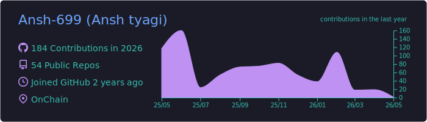
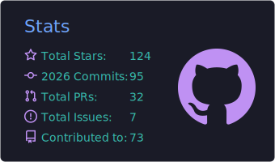
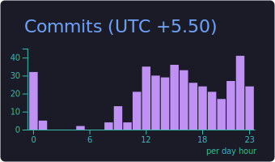

<!-- Github Stats -->

  <h3>Github Stats</h3>

  <!-- Profile Summary & Streak side‑by‑side -->
  

    
  

  

    
  

  <!-- Activity Stats -->
  

    
    
  

  <!-- Trophies -->
  

    
  

<!-- Language and Tools -->

<!-- Tech Stack -->

###  Tech Stack

 

  
  
  

  

  

  

