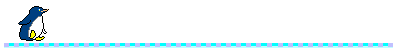

    

  <h3>Contact Me</h3>
  <kbd>
    

      

        <strong></strong>  
        
        &nbsp;
        
        &nbsp;
        
        &nbsp;
        
      

    

  </kbd>

 

  

<!-- Github Stats -->

  <h3>Github Stats</h3>

  <!-- Profile Summary and Streak -->
  

    
  

  

    
  

  <!-- Language Stats -->
  <!-- 

    
    
  
 -->

  <!-- Activity Stats -->
  

    
    
  

  <!-- Trophies -->
  

 

  

  

<!-- Language and Tools -->

  <h3>Technologies and Tools</h3>

  <kbd>
    

      

         
        <strong>Programming Languages</strong>
         
        

         
        
  
  
  
  
  
  
  
  
  
      

    

  </kbd>

  <kbd>
    

      

         
        <strong>Libraries, Frameworks & Databases</strong>
         
        

         
        
  
  
  
  
  
  
  
  
  
  
      

    

  </kbd>

  <kbd>
    

      

         
        <strong>DevOps & Cloud</strong>
         
        

         
        
  
  
  
  
  
  
  
  
  
      

    

  </kbd>

  <kbd>
    

      

         
        <strong>Operating Systems, Platforms & Networks</strong>
         
        

         
        
  
  
  
  
  
  
  
  
  
      

    

  </kbd>

  <kbd>
    

      

         
        <strong>IDEs,Testing,Package Manager  </strong>
         
        

         
        
  
  
  
   
  
  
    

  </kbd>

  

